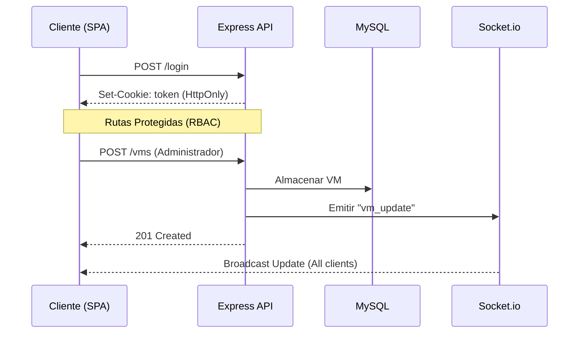

# IFX VM Management Backend - Prueba Técnica

Este es el backend para la SPA de gestión de máquinas virtuales (VMs), diseñado con un enfoque en seguridad, escalabilidad y actualizaciones en tiempo real.

## 🏗️ Decisiones Arquitectónicas

Se ha utilizado **Clean Architecture** para garantizar que la lógica de negocio sea independiente de los detalles de implementación (como la base de datos o el framework web).

- **Node.js + TypeScript**: Para un tipado fuerte y un entorno de ejecución rápido.
- **Pattern Repository**: Permite alternar entre una base de datos MySQL y una implementación en memoria fácilmente.
- **JWT en Cookies HttpOnly**: Se eligió esta estrategia sobre `localStorage` para mitigar ataques XSS y CSRF, siguiendo los requisitos de seguridad de nivel senior.
- **Socket.io**: Para la sincronización en tiempo real de los cambios de estado de las VMs entre todos los clientes conectados.

## 📊 Diagrama de Arquitectura (Real-Time Flow)



## 🛠️ Guía de Despliegue Local

1. **Prerrequisitos**: Node.js v18+ y una instancia de MySQL.
2. **Configuración**:
   ```bash
   cp .env.example .env
   # Edita el .env con tus credenciales de MySQL
   ```
3. **Instalación**:
   ```bash
   npm install
   ```
4. **Base de Datos & Seed**:
   ```bash
   # Crea la DB, las tablas e inserta 5 VMs de ejemplo
   npm run db:setup
   ```
5. **Ejecución**:
   ```bash
   npm run dev
   ```

## 🔑 Credenciales de Prueba (Mocks)

| Usuario | Email | Password | Rol |
| :--- | :--- | :--- | :--- |
| **Administrador** | `admin@ifx.com` | `123456` | Administrador |
| **Cliente** | `cliente@ifx.com` | `123456` | Cliente |

## 🤖 Bitácora de IA

1. **Herramientas**: Antigravity (Gemini 3 Flash).
2. **Trabajo Delegado**: Generación del boilerplate de Clean Architecture, configuración de scripts de compilación de TS y esquemas base de SQL.
3. **Intervención Humana (Antigravity)**: 
   - Refactorización de los controladores para manejar el contexto `this` en Express.
   - Implementación de la lógica de re-intento para la creación de la base de datos automática.
   - Solución de conflictos de tipos entre Express 5 y JWT sobre la propiedad `expiresIn`.
4. **Prompts Clave**: 
   - *"Estructura el proyecto siguiendo los principios de Clean Architecture (capas de Routes, Controllers, Services y Models)."*
   - *"Implementa la lógica para que el token se envíe al cliente mediante res.cookie con httpOnly: true y sameSite: strict."*
   - *"Cada vez que se cree o elimine una VM, el servidor debe emitir un evento global llamado vm_update."*